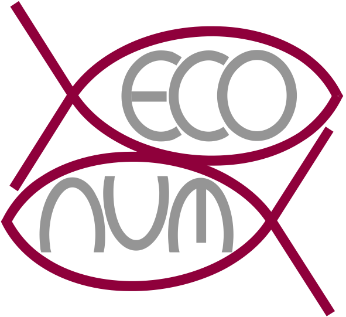

<!-- README.md is generated from README.Rmd. Please edit that file -->

```{r, include = FALSE}
knitr::opts_chunk$set(
  collapse = TRUE,
  comment = "#>",
  fig.path = "man/figures/README-",
  out.width = "100%"
)
```




# coral.growth

<!-- badges: start -->
[](https://www.tidyverse.org/lifecycle/#experimental)
[](https://opensource.org/licenses/MIT)
[](https://travis-ci.org/EcoNum/coral.growth)
[](https://ci.appveyor.com/project/EcoNum/coral.growth)
[](https://codecov.io/gh/EcoNum/coral.growth?branch=master)
[](https://cran.r-project.org/package=coral.growth)
<!-- badges: end -->


Coral reefs are considered one of the most biodiverse marine ecosystems on the planet. Coral reefs host a large and various communities of organisms such as fishes, echinoderms, plankton, etc. The coral reef is a perfect example of the Darwin Paradox, i.e. it has a high productivity when the available nutrients are low (oligotrophic seawater). The protection of this ecosystem must be protected. 

The study of the growth of the corals is a starting point to know the health status of corals. 

The goal of coral.growth package is to propose several functions and examples datasets to study the growth of the coral.

## Installation

### Development version

You can install the devlopment version of coral.growth from Github with:

``` r
remotes::install_github("econum/seal.econum", build_vignettes = TRUE)
```

## Contributors

- [Engels Guyliann](https://github.com/GuyliannEngels)

- [Philippe Grosjean](https://github.com/phgrosjean)

## Note

    This package is developped with the SciViews Box 2019. 


To learn more, please visit <http://www.sciviews.org>


--------------

Please note that the 'coral.growth' project is released with a [Contributor Code of Conduct](CODE_OF_CONDUCT.md). By contributing to this project, you agree to abide by its terms.

---------------
